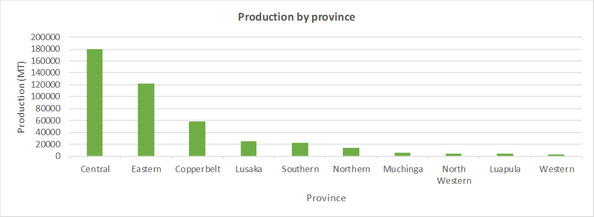
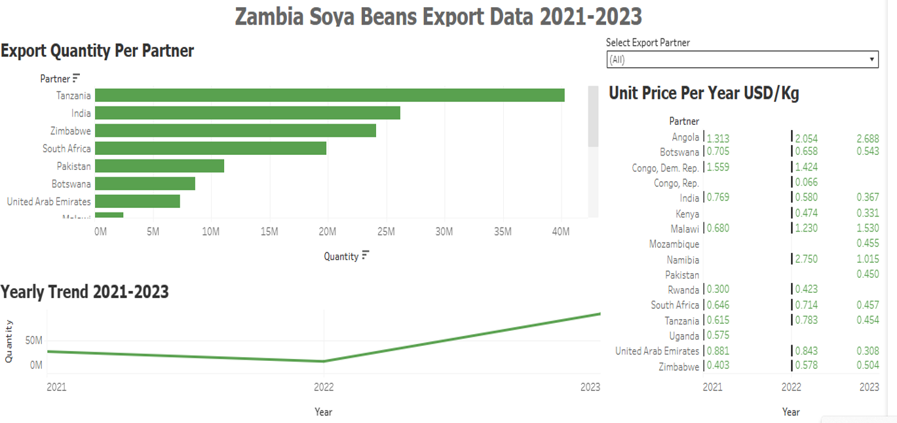
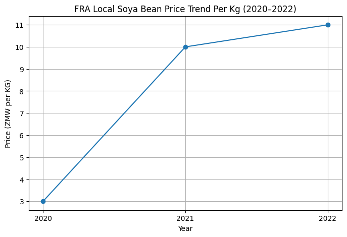
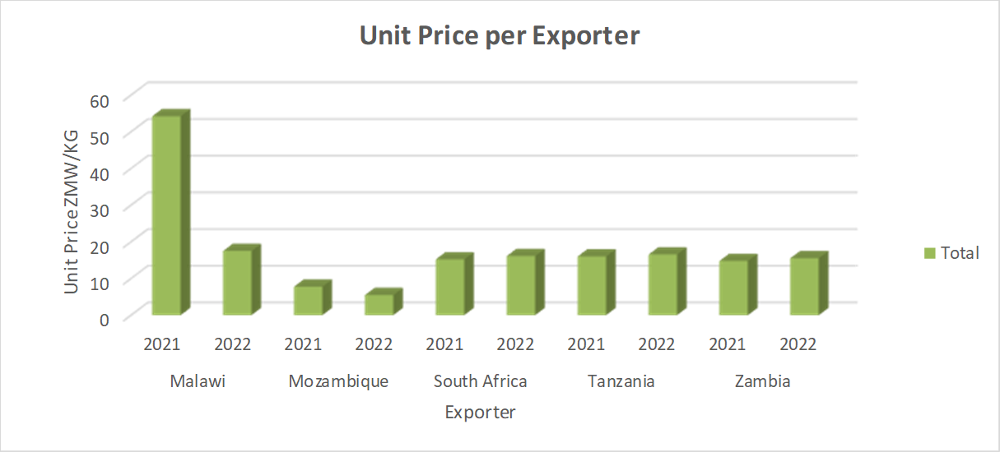

# Zambia Soya Bean Export Analysis 2021–2022 | Market Trends & Prices

This report provides a detailed analysis of Zambia’s soya bean exports between 2021 and 2022. It evaluates export volumes, pricing trends, regional production, and local market returns, offering actionable insights for farmers, agribusinesses, and trade analysts. The analysis uses Python, Tableau, and Excel to generate data-driven visuals and scenario comparisons, supporting evidence-based decisions in agricultural trade and production strategy.

The goal is to present a structured, data-driven perspective on Zambia’s soya bean export performance over the 2021–2022 period and contextualize it within local market conditions. The core question driving this analysis is: **Does exporting soya beans offer better returns for Zambian farmers and agribusinesses than selling locally?**

**Original Article:** [Zambia’s Soya Beans Export Pulse (2021–2022 Data)](https://agricultureinzambia.com/zambias-soya-beans-export-pulse-2021-2022-data/)

---

## Tools and Methods
- *Python (Pandas, Matplotlib, Seaborn)*: Data cleaning, statistical analysis, and visualizations.  
- *Tableau*: Interactive charts for export volume trends and price comparisons.  
- *Excel*: Data organization, calculations, and scenario modeling.

---

## Project Overview

Zambia’s soya bean export performance showed mixed trends between 2021 and 2022:

- **Export destination patterns (2021)** show South Africa, India, and Tanzania as the leading partners in value and quantity terms.
- **Export destination patterns (2022)** reveal a shift in partner rankings, though South Africa and Tanzania remain significant buyers. 
- Total export value declined from roughly USD 21.5 million in 2021 to about USD 12.3 million in 2022, with similarly lower quantities exported. 

The repository’s datasets and analyses aim to replicate and extend these insights, allowing interactive exploration of:
- year-on-year export volume changes,
- structure of export destination markets,
- price evolution over the period,
- comparison of local market prices against export price performance.

---

## Results

### Regional Production Insights
- Analysis of production volumes by province reveals concentration in areas with established infrastructure and transport links.  
- Eastern and Central provinces dominate production, with smaller contributions from Southern and Northern regions.  
- Understanding *regional yield patterns* is essential for planning export logistics and targeting high-demand markets efficiently.



### Export Volumes and Destinations
- Total export revenue fell from *USD 21.5M in 2021* to *USD 12.3M in 2022*.  
- *South Africa and Tanzania* remained the largest importers, accounting for over 60% of total exports.  
- A decline in exports to other regional markets highlights potential *dependency risks* and opportunities for diversification.  
- Provincial production is concentrated in *Central and Eastern provinces*, which significantly influences export capacity and logistics planning.


Figure 3: Export Unit Prices and Quantity by destination(USD/KG, 2021-2022). Blank values indicate years with no recorded exports to that destination
View interactive dashboard on Tableau Public: https://public.tableau.com/app/profile/shimanga.mubitana/viz/Book1_17648309333440/Dashboard1

### Export vs Local Market Prices
- Average export prices exceeded local market prices by 15–25%, suggesting *higher profitability potential* for farmers with access to export channels.  
- Price volatility analysis indicates that while exports offer higher returns, *market timing and partner selection* are critical to avoid revenue dips.  
- Scenario modeling shows that even small shifts in export prices or exchange rates could significantly impact farm-level income.


Figure 4:Local FRA prices(ZMW/KG)

### Competitor & Price Comparisons
- Additional price and competitor data were analysed in **Excel**,
  with comparisons between local market prices and typical export rates.



Figure 5: Zambia vs regional export competitors

---

## Key Insights
- **Export potential is significant**: Soya bean exports can generate higher revenue than local sales if farmers and cooperatives optimize logistics and market selection.  
- **Market concentration is a risk**: Heavy reliance on South Africa and Tanzania makes exports vulnerable to regional disruptions.  
- **Data-driven decision-making** is critical*: Price comparisons, scenario modeling, and provincial production mapping can guide investment and trade strategies.
- **Production Concentration**: Central and Eastern Provinces dominate Zambia's soya bean output.
- **Export Price Premium**: Converted export prices to Angola, DRC, India, and South Africa consistently exceeded the local FRA price.
- **Volume-Price Trade-off**: Markets like India paid higher prices for smaller volumes, while Tanzania and Zimbabwe took larger volumes at lower rates.
- **Competitive Positioning**: Zambia occupies a middle-ground, exporting at higher prices than Mozambique but competitively with Tanzania and South Africa.
- **Feasibility Hinges on Scale**: The export price advantage can be eroded by logistics costs, making organization and aggregation critical for profitability.
---

## Next Steps / Recommendations
- Explore *alternative regional and international markets* to reduce dependency risk.  
- Strengthen *farm-level coordination* to leverage bulk exports and reduce costs.  
- Maintain *updated trade and production data* for continuous scenario analysis and forecasting.
---

## Notes & References

The export figures in this project draw on international trade statistics for Zambia:
- Zambia exported ~USD 21.5 million of soya beans in 2021.
- Export value dropped to approximately USD 12.3 million in 2022.

Additional data sources and contextual notes can be added once production and local pricing datasets are included.
As cited in the original article:
*   **Export Data**: FAO (Food and Agriculture Organization)
*   **Regional Export Data**: World Bank
*   **Production Data**: Zamstats (Zambia Statistics Agency)
*   **Local Price Data**: PMRC Zambia & Parliament of Zambia
---

## Conclusion
This analysis demonstrates that exporting soya beans can be economically attractive, offering a price premium over local FRA prices. However, success is not automatic, it depends heavily on achieving scale, controlling logistics costs, and targeting the right destination markets. This repository provides the data and code backbone to support these insights.

---
*Analysis and article by Shimanga Mubitana.*
```
